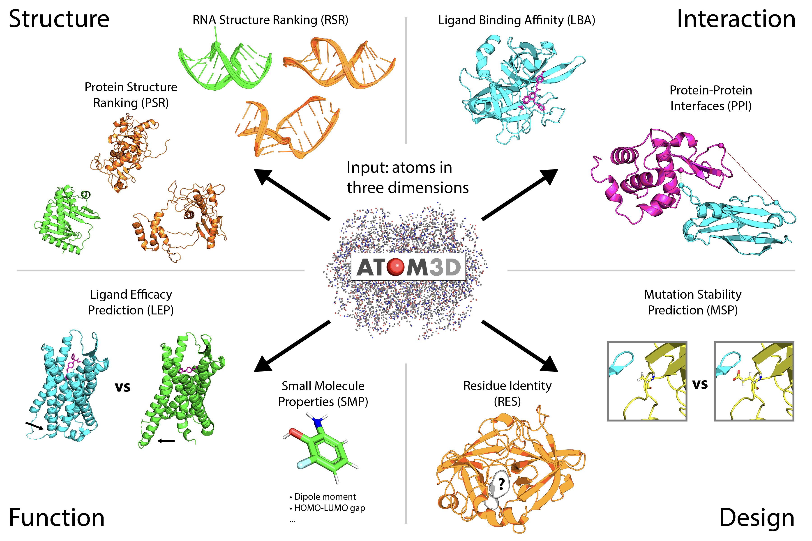

## ATOM3D: Tasks on Molecules in Three Dimensions

ATOM3D is a unified collection of datasets concerning the three-dimensional structure of biomolecules, including proteins, small molecules, and nucleic acids. These datasets are specifically designed to provide a benchmark for machine learning methods which operate on 3D molecular structure, and represent a variety of important structural, functional, and engineering tasks. All datasets are provided in a standardized format along with corresponding processing code and dataloaders for common machine learning frameworks (PyTorch and TensorFlow). ATOM3D is designed to be a living database, where datasets are updated and tasks are added as the field progresses.

Current datasets include:
  - Small Molecule Properties (SMP)
  - Protein Interface Prediction (PIP)
  - Residue Identity (RES)
  - Mutation Stability Prediction (MSP)
  - Ligand Binding Affinity (LBA)
  - Ligand Efficacy Prediction (LEP)
  - Protein Structure Ranking (PSR)
  - RNA Structure Ranking (RSR)
  
These datasets can be roughly grouped into four categories that represent a wide range of problems, spanning single molecular structures and interactions between biomolecules as well as molecular functional and design/engineering tasks.

### References

**Repository**: All dataset processing code and installation instructions can be found at [https://github.com/drorlab/atom3d](https://github.com/drorlab/atom3d)

**Paper**: Please see our [preprint](arxiv.org/XXXX) for further details on the datasets and benchmarks.

**NeurIPS LMRL Workshop 2020**: Check out our [poster] and [talk] at the Learning Meaningful Representations of Life workshop at NeurIPS 2020.
